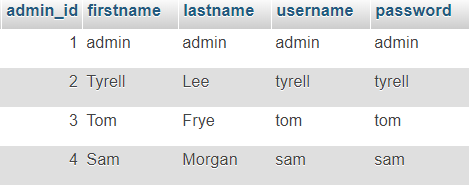

# csci50700-spring2018-marketplace

The project should be run in port number 2323 and machine in-csci-rrpc01.cs.iupui.edu.
The code folder has the java/class files.
The documentation folder has the Assignment Reports.

# Assignment - 6

Report: csci50700_spring2018_marketplace/documentation/Assignment-5-Report.pdf

## Instructions to Run Assignment - 6:

1. Open Putty and connect to `in-csci-rrpc01.cs.iupui.edu` and navigate to the directory where you want to clone this repository.
2. Using the command `git clone https://github.iu.edu/vnalluri/csci50700_spring2018_marketplace.git` , clone it into your directory.
3. Use the command `cd csci50700_spring2018_marketplace/code/Market/src` to navigate to the src folder.
4. Use the command `make` in terminal to compile all the files.
5. Use the command, `rmiregistry 2323&` in Putty.
6. To start up the server, use the command `make runServer` in Putty.
  Sever is ready.
7. Now open a new Putty Window and connect to any of the machines and navigate to the directory in which you have cloned the repository in Step 1.
8. Use the command, `cd csci50700_spring2018_marketplace/code/Market/src` to navigate to the src folder.
9. Now, to start the client view, use the command, `make runClient`.
10. The view askes for login details.
11. You can access the database at : `https://in-csci-rrpc01.cs.iupui.edu/phpmyadmin/`.
- Username: `vnalluri`.
- Password: `vnalluri`
12. If you want to login as Customer, then login as one of the following:

13. If you want to login as Adminstrator, then login as one of the following:

14. Once you have logged in, you will a menu. The menu has all the funtionalities the application provides.
15. Depending upon your access role, you will be able to access these functionalities.

If you want to connect as another client, then follow steps from 7.

### Outline of the all of the files:
Model.java is the interface which ModelImpl is implementing.
ModelImpl.java is the server.
View.java is the client. Along with View.java there is a seperate interface for Adminstrator and Customer as AdminstatorView.java and CustomerView.java
ControllerImpl.java has the implementation for connecting to the appropriate server methods.
Entity classes are Adminstrator.java, Customer.java, Item.java, Cart.java, PurchaseReceipt.class

Related to Command Pattern: Command.java, ValidateCustomerDetails.java, ValidateAdminDetials.java, CommandInvoker.java, CustomerService.java, CustomerServiceImpl.java, AdminService.java, AdminServiceImpl.java and CommandInvoker.java.

Related to Abstract Factory Pattern: FactoryCreator.java, AbstractFactory.java, HomeViewFactory.java, ErrorViewFactory.java, HomeView.java, ErrorView.java, CustomerHomeView.java, AdminHomeView.java, LoginErroView.java, PageNotFountView.java, ViewInterface.java and LoginView.java

Related to FrontController Pattern: FrontContoller.java, FrontControllerImpl.java, Dispatcher.java, DispatcherImpl.java.

# Machines for reference
1. `in-csci-rrpc01.cs.iupui.edu - 10.234.136.55`
2. `in-csci-rrpc02.cs.iupui.edu - 10.234.136.56`
3. `in-csci-rrpc03.cs.iupui.edu - 10.234.136.57`
4. `in-csci-rrpc04.cs.iupui.edu - 10.234.136.58`
5. `in-csci-rrpc05.cs.iupui.edu - 10.234.136.59`
6. `in-csci-rrpc06.cs.iupui.edu - 10.234.136.60`
